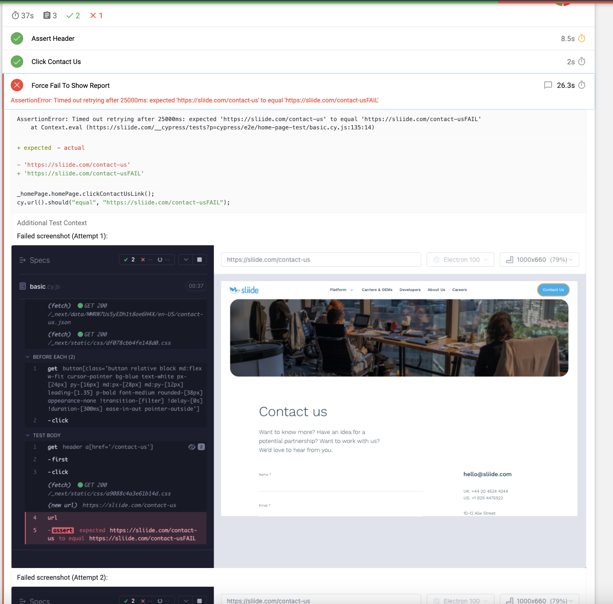

# cypress-template

Basic Cypress framework template
This Repo just contains the basics to get up and running with a Cypress suite.

# Install instructions Mac

1. [Install Homebrew](https://docs.brew.sh/Installation)
2. Install Node `brew install node`
3. From the cypress root directory run `npm install` to pull dependencies
4. Run `npm run cypress:open` to open the Cypress test runner

# Dependencies

- [Cypress](https://www.cypress.io/)
- [Cypress-audit](https://github.com/mfrachet/cypress-audit#readme) - Currently doesn't work with Cypress 10 but should hopefully be fixed soon
- [cypress-mochawesome-reporter](https://github.com/LironEr/cypress-mochawesome-reporter#readme)
- [cypress-multi-reporters](https://github.com/you54f/cypress-multi-reporters)
- [ESLint](https://eslint.org/)
- [eslint-plugin-chai-friendly](https://github.com/ihordiachenko/eslint-plugin-chai-friendly#readme)
- [eslint-plugin-cypress](https://github.com/cypress-io/eslint-plugin-cypress#readme)
- [mochawesome-report-generator](https://github.com/adamgruber/mochawesome-report-generator#readme)
- [prettier](https://prettier.io/)

# Scripts We Can Run

- `npm run cypress:open` - Opens the Cypress runner so you can run any spec file(s) locally and also go back and inspect exactly what was happening at each step.
- `npm run prettier:check` - Runs prettier and reports any code formatting issues e.g. incorrect tab indentations
- `npm run prettier:fix` - Runs prettier and automatically fixes any code format issues found
- `npm run eslint:check` - Runs esLint using the Cypress and chai recommended rules and reports any issues e.g. it will warn you if you force a sleep in a test.
- `npm run eslint:attemptFix` - Runs esLint and attempts to fix any issues (not always possible you may need to rewrite your code to not break a rule)
- `npm run linting` - Runs both prettier and esLint checks and reports any issues
- `npm run beforePR` - Runs both prettier and esLint attempt fix scripts, useful to run this before you open a PR so you can be sure the pipeline will pass the linting job
- `npm run allTests` - Runs the full suite of tests in a headless browser

# Example Test Report

cypress-mochawesome-reporter automatically generates a report when the tests are run using the cypress run command e.g. `npm run allTests` the report can be found in `cypress/reports` For failed tests a screenshot of the Cypress runner is provided which shows what was rendered on the page at the point of failure and what the error message was.

This example shows what happened when a test was forced to fail, here we are expecting to be on https://sliide.com/contact-usFAIL but are actually on https://sliide.com/contact-us, you can see the screenshot showing what was on the page and the error message the test code displayed.

# Notes

- If you are familiar with Cypress you should probably refresh your knowledge as version 10 made a lot of changes to the structure of a Cypress framework. The plugin folder and cypress.json have been removed.
- Spec files now all need the .cy.js extension (new to Cypress 10.0)
- When run in a pipeline or using cypress run a failed test will attempt a retry 3 times before moving on and failing the test.
- When run through the Cypress test runner a failed test will not retry, this is because the runner is only used locally and if a test fails you will have all the snapshots and logs to see what happened so there's no need to rerun the test multiple times before you start to debug it.
- A video is recorded after each test, this can be disabled in `cypress.config.js` if needed
- [Code coverage](https://docs.cypress.io/guides/tooling/code-coverage#Install-the-plugin) can be added - not done here because there's no app code to run against
- [Visual testing](https://docs.cypress.io/guides/tooling/visual-testing#Applitools) can be added but would require a discussion as we would eventually need to purchase a subscription.
